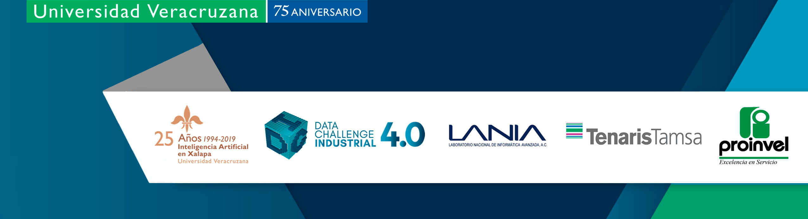

author: Horacio Tapia-McClung
summary: PAAII Description
id: paaii-announcement
categories: codelab,markdown
environments: Web
status: Draft
feedback link: https://github.com/htapia/paaii

# Predictive Analytics and Artificial Intelligence for the Industry 4.0 Tutorial

## Announcement
Duration: 0:01:00

### PAAII Tutorial

As part of the local activities around the Mexican International Conference MICAI 2019, the *Centro de Investigación en Inteligencia Artificial, CIIA*, of the *Universidad Veracruzana, UV*, announces the 

**Predictive Analytics and Artificial Intelligence for the Industry 4.0 Tutorial**
Tuesday October 29th 2019

The tutorial is developed in the frame of the Data Challenge Industrial 4.0 event that will take place in the CIIA on october 26-27, 2019. You can read more about this event in our [official channels](www.fb.com/laniadci).

### Tutorial speakers
 The tutorial is jointly prepared by Dr. Horacio Tapia-McClung (CIIA) and Dr. Gibran Etcheverry Dodger (UDLAP). If you are interested, please use the register link below and let us know. We would be very pleased to see you there. 

## Overview
Duration: 0:02:00

### Abstract
Analytics is revolutionizing our every day lives. From consumer electronics, smartphones, smart appliances, smart cars, etc., to new bussines models, Netflix, Uber, Aribnb, etc., many if not all these comodities are powered by a large and increasing number of new methods, tools and technologies.

Something similar is slowly happening across industrial sectors, but in a data-driven world, industrial data analytics is still far from the innovations we have experienced in the past two decades.

In Mexico these changes occur at a slower rate than in other places around the world like Germany, the U.S., Japan, etc. Nevertheless, data analytics in industrial settings will be crucial in the next 5 years as discussions and initiatives on the Industrial Internet of Things and 'Industria 4.0' are become a reality in the country.

This tutorial is intended to present some examples of Predictive Analytics and Artificial Intelligence computational methods applied to concrete problems that often occur accross diverse industry sectors, using the Python programming language. The selected cases are: 
1. Predicting failure in equipment using sensor data;
2. Predicting Time To Failure or Remaining Useful Life, and
3. TBD

### Requirements
In this tutorial we will use the Python programming language using Google's [Colaboratory](https://colab.research.google.com/) free Jupyter notebook environment. We are going to assume familiarity with the Python programming language although no strict previous experience with is required. 